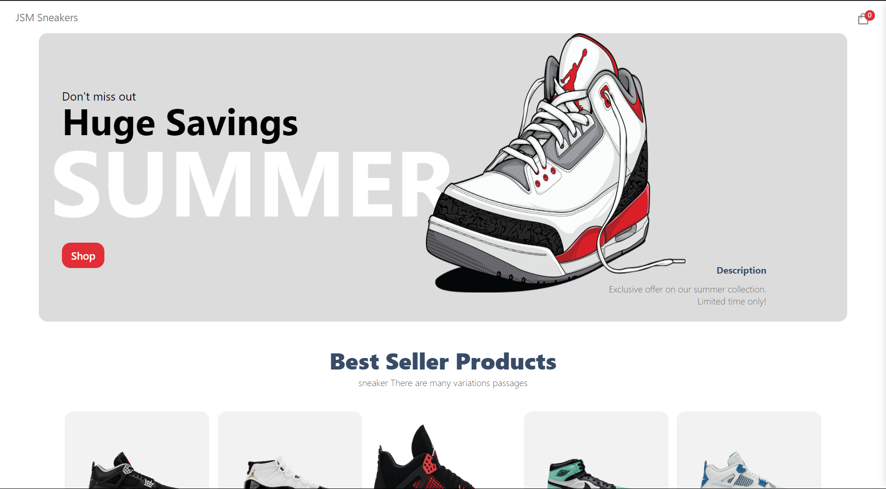
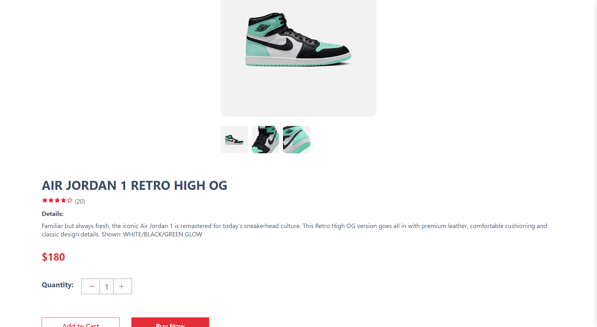
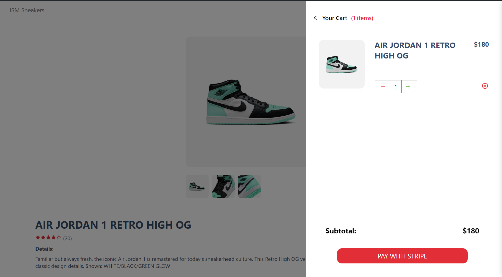
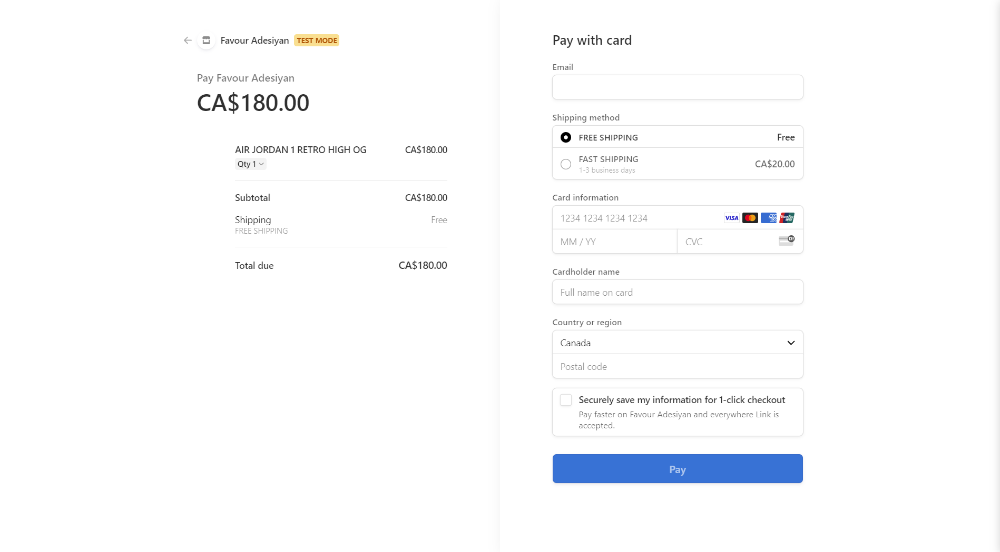

# SneakAttack E-commerce App

SneakAttack is a cutting-edge e-commerce platform that offers a seamless shopping experience for sneaker enthusiasts. Built with modern technologies, it ensures fast performance and secure transactions.

This is a [Next.js](https://nextjs.org/) project bootstrapped with [`create-next-app`](https://github.com/vercel/next.js/tree/canary/packages/create-next-app).

## Features

- **User Authentication:** Secure login and registration system.
- **Product Listings:** Detailed product pages with images, descriptions, and prices.
- **Shopping Cart:** Add, remove, and update products in the cart.
- **Stripe Payment Integration:** Secure payment processing with Stripe.
- **Order Management:** Track order status and history.
- **Responsive Design:** Optimized for both desktop and mobile devices.
- **Search Functionality:** Easily find products using the search bar.
- **Admin Panel:** Manage products, orders, and users.

## Technologies Used

- **Framework:** [Next.js](https://nextjs.org/)
- **Deployment:** [Vercel](https://vercel.com/)
- **Payment Gateway:** [Stripe](https://stripe.com/)
- **Database and CMS:** [Sanity](https://www.sanity.io/)
- **Styling:** CSS-in-JS (e.g., styled-components), Tailwind CSS, etc.
- **State Management:** Redux, Context API, etc.

## Getting Started

First, run the development server:

```bash
npm run dev
# or
yarn dev
# or
pnpm dev
# or
bun dev
```

Open [http://localhost:3000](http://localhost:3000) with your browser to see the result.

You can start editing the page by modifying `pages/index.js`. The page auto-updates as you edit the file.

[API routes](https://nextjs.org/docs/api-routes/introduction) can be accessed on [http://localhost:3000/api/hello](http://localhost:3000/api/hello). This endpoint can be edited in `pages/api/hello.js`.

The `pages/api` directory is mapped to `/api/*`. Files in this directory are treated as [API routes](https://nextjs.org/docs/api-routes/introduction) instead of React pages.

This project uses [`next/font`](https://nextjs.org/docs/basic-features/font-optimization) to automatically optimize and load Inter, a custom Google Font.

## Environment Variables

Create a `.env.local` file in the root directory and add your environment variables:

```env
NEXT_PUBLIC_STRIPE_PUBLIC_KEY=your_stripe_public_key
STRIPE_SECRET_KEY=your_stripe_secret_key
SANITY_PROJECT_ID=your_sanity_project_id
SANITY_DATASET=your_sanity_dataset
SANITY_TOKEN=your_sanity_token
NEXT_PUBLIC_VERCEL_URL=your_vercel_url
```

## Learn More

To learn more about Next.js, take a look at the following resources:

- [Next.js Documentation](https://nextjs.org/docs) - learn about Next.js features and API.
- [Learn Next.js](https://nextjs.org/learn) - an interactive Next.js tutorial.

You can check out [the Next.js GitHub repository](https://github.com/vercel/next.js/) - your feedback and contributions are welcome!

## Deploy on Vercel

The easiest way to deploy your Next.js app is to use the [Vercel Platform](https://vercel.com/new?utm_medium=default-template&filter=next.js&utm_source=create-next-app&utm_campaign=create-next-app-readme) from the creators of Next.js.

Check out our [Next.js deployment documentation](https://nextjs.org/docs/deployment) for more details.

## Live View






## Contributing

Contributions are welcome! Please fork the repository and create a pull request with your changes.

## License

This project is licensed under the MIT License. See the [LICENSE](LICENSE) file for details.

---

Made with ❤️ by [Favour Adesiyan](https://github.com/favour01216) 👋
